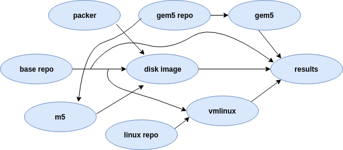

# Zen and the art of gem5 experiments

<!--
## Getting this repository
**Note: Please use --recursive flag with git clone while cloning this repo, as it uses git sub-modules.**
```
git clone --recursive git@github.com:darchr/fs-x86-test
```

If you forget to clone with `--recursive` flag, you can run the following to initialize the submodules.

```
git submodule update --init --recursive
```
-->

## Introduction
The primary motivation behind gem5art is to provide an infrastructure to use a structured approach to run experiments with gem5. Particular goals of gem5art include:

- structured gem5 experiments
- easy to use
- resource sharing
- reproducibility
- easy to extend
- documentation

gem5art is mainly composed of the following components:

- a database to store artifacts
- python objects to wrap gem5 experiments (gem5Run)
- a celery worker to manage gem5 jobs (Tasks)

The following diagram shows the interaction among different components (artifacts) involved during full-system experiments with gem5.



Everything is contained in a base git repository (base repo) artifact which can keep track of changes in files not tracked by other repositories.
packer is a tool to generate disk images and serves as an input to the disk image artifact. gem5 source code repo artifacts serves as input to other two artifacts (gem5 binary and m5 utility).
linux source repository and base repository (specifically kernel config files from there) are used to build the disk image and multiple artifacts then generate the results artifact.

