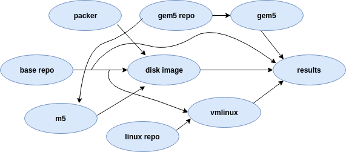

# Introduction

The primary motivation behind gem5art is to provide an infrastructure to use a structured approach to run experiments with gem5. Particular goals of gem5art include:

- structured gem5 experiments
- easy to use
- resource sharing
- reproducibility
- easy to extend
- documentation

gem5art is mainly composed of the following components:

- a database to store artifacts (`gem5art-artifacts`)
- python objects to wrap gem5 experiments (`gem5art-run`)
- a celery worker to manage gem5 jobs (`gem5art-tasks`)

The process of performing experiments (starting from scratch) can quickly become complicated due to involvement of multiple components.
This can be intimidating for new users, and it can be difficult to manage even for experienced researchers.
As an example, following is a diagram which shows the interaction that takes place among different components (artifacts) while running full-system experiments with gem5.



<br>
*Figure: Flowchart of gem5 full system mode use case*

Each bubble in the diagram represents a different [artifact](artifacts) which is one small part of a gem5 experiment culminating in the results from the gem5 execution.
All of the lines show dependencies between artifacts (e.g., the disk image depends on the m5 binary).

Everything in this example is contained in a base git repository (base repo) artifact which can keep track of changes in files not tracked by other repositories.
[Packer](https://packer.io) is a tool to generate disk images and serves as an input to the disk image artifact.
gem5 source code repo artifact serves as an input to two other artifacts (gem5 binary and m5 utility).
Linux source repository and base repository (specifically kernel config files) are used to build the disk image and multiple artifacts then generate the final results artifact.

gem5art serves as a tool/infrastructure to streamline this entire process and keeps a track of things as they change thus leading to reproducible runs.
Moreover, it allows to share the artifacts, used in above example, among multiple users.
Additionally, gem5art tracks results like all other artifacts, so they can be archived and queried later to aggregate many different gem5 experiments.


## Installing gem5art

gem5art is available as a PyPI package and can be installed using pip.
Since, gem5art requires Python 3, we recommend creating a virtual environment with Python 3 before using gem5art.
Run the following commands to create virtual environment and install gem5art:

```sh
virtualenv -p python3
pip install gem5art-artifact gem5art-run gem5art-tasks
```