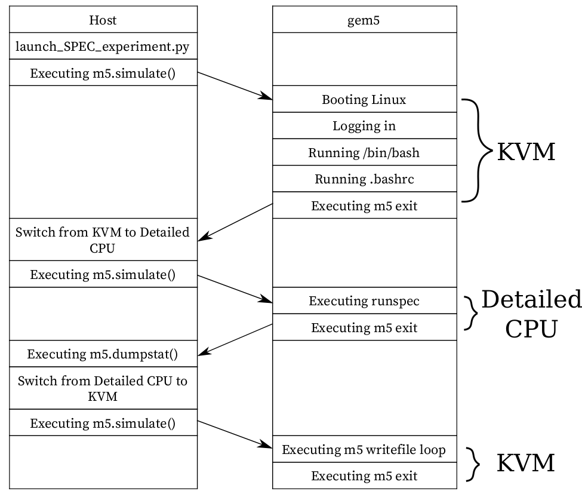

# Tutorial: Run SPEC CPU 2017 Benchmarks in Full System Mode with gem5art  

## Introduction  
In this tutorial, we will demonstrate how to utilize gem5art to run SPEC CPU 2017 benchmarks in gem5 full system mode. 
The full example with all of the gem5art tutorials can be found [here](https://github.com/darchr/gem5art-experiments). 
The scripts in this tutorial work with gem5art-* v0.3.1.  

**Note**: This steps in this tutorial are mostly identical to that of [the SPEC 2006 tutorial](spec2006-tutorial.md). 
The differences are in the scripts used to create the disk image, and the name of the benchmarks.  

### SPEC CPU 2017 Benchmarks  
More details about those benchmarks are [here](https://www.spec.org/cpu2017/Docs/).  

### gem5 Full System Mode  
Different from the gem5 SE (syscall emulation) mode, the full system mode uses the Linux kernel instead of emulating syscalls. 
Therefore, the results would be more realistic if system calls are a significant portion of the benchmarks. 
In order to run gem5 in the full system mode, gem5 requires a built Linux kernel, which is configurable. 
gem5 does not support all configurations in Linux, but we will provide a Linux configuration that works with gem5. 
(See the [run exit tutorial](boot-tutorial.md) for details on what kernels are currently tested with gem5.) 
Other than that, a gem5 full system configuration is also a requirement to run gem5 full system mode. 
In this tutorial, we will provide working Linux configurations, the necessary steps to build a Linux kernel, and a working gem5 full system configuration.  

### Outline of the Experiment
We structure the experiment as follows (note that there are many more ways to structure the experiments, and the following is one of them),  
* root folder  
  * gem5: a folder containing gem5 source code and gem5 binaries.  
  * disk-image: a folder containing inputs to produce a disk image containing SPEC CPU 2017 benchmarks.  
  * linux-configs: a folder containing different Linux configurations for different Linux kernel versions.  
  * gem5-fullsystem-configs: a folder containing a gem5 configuration that is made specifically to run SPEC CPU 2017 benchmarks.  
  * results: a folder storing the experiment's results. This folder will have a certain structure in order to make sure that every gem5 run does not overwrite other gem5 runs results.  
  * launch_spec_experiments.py: a script that does the following,  
    * Documenting the experiment using Artifacts objects.  
    * Running the experiment in gem5 full system mode.  

### An Overview of Host System - gem5 Interactions

A visual depict of how gem5 interacts with the host system. 
gem5 is configured to do the following: booting the Linux kernel, running the benchmark, and copying the SPEC outputs to the host system. 
However, since we are interested in getting the stats only for the benchmark, we configure gem5 to exit after the kernel is booted, and then we reset the stats before running the benchmark. 
We use KVM for Linux booting process as we want to quickly boot the system, and after the booting process is complete, we switch to the desired detailed CPU to run the benchmark. 
Similarly, after the benchmark is complete, gem5 exits to host, which allows us to get the stats at that point. 
After that, we switch the CPU back to KVM, which allows us to quickly write the SPEC output files to the host.  

**Important:** gem5 will output the stats again when the gem5 run is complete. 
Therefore, we will see two stats in one file in stats.txt. 
The stats of the benchmark is the the first part of stats.txt, while the second part of the file contains the stats of the benchmark AND the process of writing output files back to the host. 
We are only interested in the first part of stats.txt.
