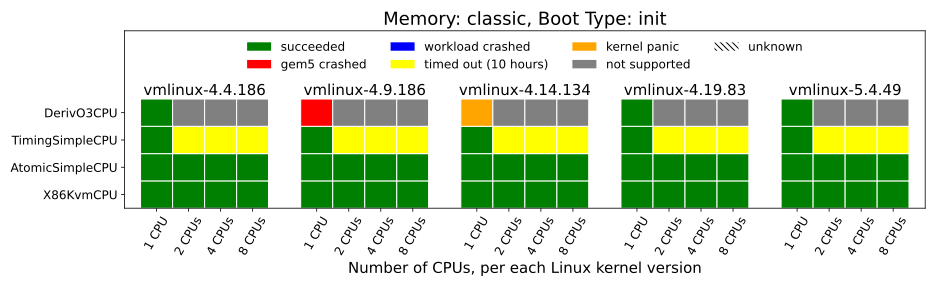
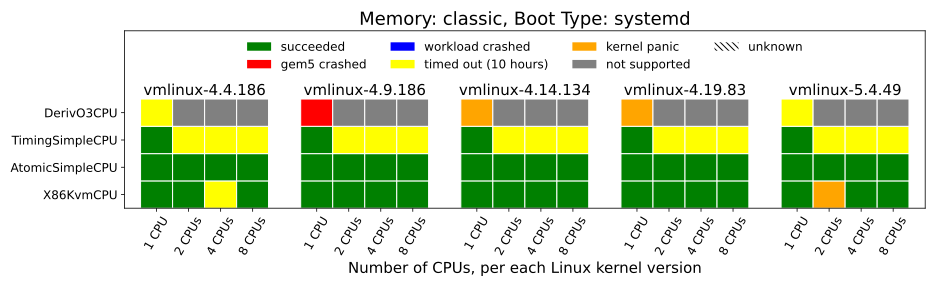
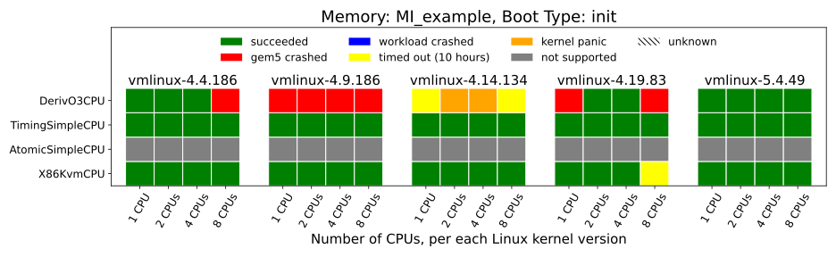
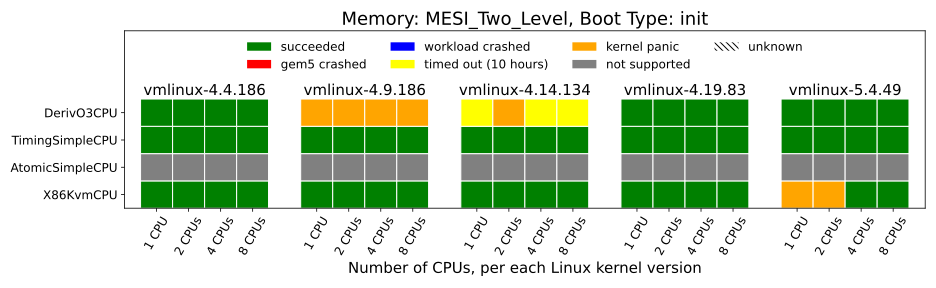
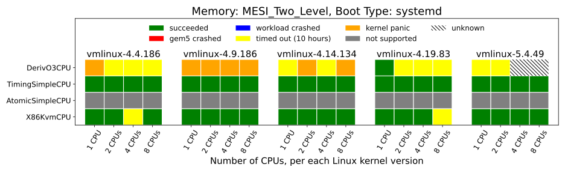

---
Authors:
  - Ayaz Akram
---

# Tutorial: Run Full System Linux Boot Tests

## Introduction
This tutorial explains how to use gem5art to run experiments with gem5. The specific experiment we will be doing is to test booting of various linux kernel versions and simulator configurations.
The main steps to perform such an experiment using gem5art include: setting up the environment, building gem5, creating a disk image, compiling linux kernels, preparing gem5 run script, creating a job launch script (which will also register all of the required artifacts) and finally running this script.

We assume the following directory structure to follow in this tutorial:

```
boot-tests/
  |___ gem5/                                   # gem5 source code
  |
  |___ disk-image/
  |      |___ shared/                          # Auxiliary files needed for disk creation
  |      |___ boot-exit/
  |            |___ boot-exit-image/           # Will be created once the disk is generated
  |            |      |___ boot-exit           # The generated disk image
  |            |___ boot-exit.json             # The Packer script
  |            |___ exit.sh                    # Exits the simulated guest upon booting
  |            |___ post-installation.sh       # Moves exit.sh to guest's .bashrc
  |
  |___ configs
  |      |___ system                           # gem5 system config files
  |      |___ run_exit.py                      # gem5 run script
  |
  |___ linux-configs                           # Folder with Linux kernel configuration files
  |
  |___ linux                                   # Linux source will be downloaded in this folder
  |
  |___ launch_boot_tests.py                    # script to launch jobs and register artifacts
```

## Setting up the environment

First, we need to create the primary directory **boot-tests** which will contain all the created artifacts to run these tests.
This directory also needs to be converted into a git repository.
Through the use of boot-tests git repo, we will try to keep track of changes in those files which are not an artifact themselves or not a part of any other artifact.
An example of such files is gem5 run and config scripts (config-boot-tests).
We want to make sure that we can keep record of any changes in these scripts, so that a particular run of gem5 can be associated with a particular snapshot of these files.
All such files, which are not part of other artifacts, will be a part of the experiments repo artifact (we will show how to register that artifact later in this tutorial).
We also need to add a git remote to this repository pointing to a remote location where we want this repository to be hosted.

Create the main directory named boot-tests and turn it into a git repo:

```sh
mkdir boot-tests
cd boot-tests
git init
git remote add origin https://your-remote-add/boot-tests.git
```

We also need to add a .gitignore file in our git repo, to ignore tracking files we don't care about:

```sh
*.pyc
m5out
.vscode
results
venv
disk-image/packer
disk-image/packer_1.4.3_linux_amd64.zip
disk-image/boot-exit/boot-exit-image/boot-exit
disk-image/packer_cache
gem5
linux-stable/
```

gem5art relies on Python 3, so we suggest creating a virtual environment (inside boot-tests) before using gem5art.

```sh
virtualenv -p python3 venv
source venv/bin/activate
```

gem5art can be installed (if not already) using pip:

```sh
pip install gem5art-artifact gem5art-run gem5art-tasks
```

## Building gem5

Next, we have to clone gem5 and build it. If you want to use the exact gem5 source that was used at the time of creating this tutorial you will have to checkout the relevant commit. If you want to try with the current version of gem5 at the time of reading this tutorial, you can ignore the git checkout command.
See the commands below:

```sh
git clone https://gem5.googlesource.com/public/gem5
cd gem5
git checkout 90a6e809629c978c2df765eb
scons build/X86/gem5.opt -j8
```
You can also add your changes to gem5 source before building it. Make sure to commit any changes you make to gem5 repo and documenting it while registering gem5 artifact in the launch script.
We will look at the details of our launch script later on, but following is how we can register gem5 source and binary artifacts that we just created.

```python
gem5_repo = Artifact.registerArtifact(
    command = 'git clone https://gem5.googlesource.com/public/gem5',
    typ = 'git repo',
    name = 'gem5',
    path =  'gem5/',
    cwd = './',
    documentation = 'cloned gem5 from googlesource and checked out release-staging-v20.1.0.0 (Sep 14, 2020)'
)

gem5_binary = Artifact.registerArtifact(
    command = '''cd gem5;
    git checkout 90a6e809629c978c2df765ebb70;
    scons build/X86/gem5.opt -j8
    ''',
    typ = 'gem5 binary',
    name = 'gem5',
    cwd = 'gem5/',
    path =  'gem5/build/X86/gem5.opt',
    inputs = [gem5_repo,],
    documentation = 'gem5 binary based on release-staging-v20.1.0.0 (Sep 14, 2020)'
)
```

Note, that the use of git checkout command in the `command` field of the gem5_binary artifact (along with the `documentation` field) will be helpful later on to figure out exactly which gem5 source was used to create this gem5 binary.

Also make sure to build the m5 utility at this point which will be moved to the disk image eventually.
m5 utility allows to trigger simulation tasks from inside the simulated system.
For example, it can be used to dump simulation statistics when the simulated system triggers to do so.
We will mainly need m5 to exit the simulation when the simulated system boots linux.

```sh
cd gem5/util/m5/
scons build/x86/out/m5
```

## Creating a disk image
First create a disk-image folder where we will keep all disk image related files:

```sh
mkdir disk-image
```

We will follow the similar directory structure as discussed in [Disk Images](../main-doc/disks.md) section.
Add a folder named shared for config files which will be shared among all disk images (and will be kept to their defaults) and one folder named boot-exit which is specific to the disk image needed to run experiments of this tutorial.
Add three files [boot-exit.json](https://github.com/darchr/gem5art/blob/master/docs/disks/boot-exit/boot-exit.json), [exit.sh](https://github.com/darchr/gem5art/blob/master/docs/disks/boot-exit/exit.sh) and [post-installation.sh](https://github.com/darchr/gem5art/blob/master/docs/disks/boot-exit/post-installation.sh) in boot-exit/ and [preseed.cfg](https://github.com/darchr/gem5art/blob/master/docs/disks/shared/preseed.cfg) and [serial-getty@.service](https://github.com/darchr/gem5art/blob/master/docs/disks/shared/serial-getty@.service) in shared/.

**boot-exit.json** is our primary configuration file. The provisioners and variables section of this file configure the files that need to be transferred to the disk and other things like disk image's name. **post-installation.sh** (which is a script to run after Ubuntu is installed on the disk image) makes sure that the m5 binary is installed on the system and also moves the contents of our other script (**exit.sh**, which should be already transferred inside the disk image as configured in **boot-exit.json**) to **.bashrc** as **exit.sh** contains the stuff that we want to be executed as soon as the system boots. **exit.sh** just contains one command `m5 exit`, which will eventually terminate the simulation as the system boots up.

Next, download packer (if not already downloaded) in the disk-image folder:

```
cd disk-image/
wget https://releases.hashicorp.com/packer/1.4.3/packer_1.4.3_linux_amd64.zip
unzip packer_1.4.3_linux_amd64.zip
```
Now, to build the disk image, inside the disk-image folder, run:

```
./packer validate boot-exit/boot-exit.json

./packer build boot-exit/boot-exit.json
```

Once this process succeeds, the disk image can be found on `boot-exit/boot-exit-image/boot-exit`.
A disk image already created following the above instructions can be found, gzipped, [here](http://dist.gem5.org/dist/v20-1/images/x86/ubuntu-18-04/boot-exit.img.gz).


## Compiling the linux kernel

In this tutorial, we want to experiment with different linux kernels to examine the state of gem5's ability to boot different linux kernels. These tests use following five LTS (long term support) releases of the Linux kernel:

- 4.4.186
- 4.9.186
- 4.14.134
- 4.19.83
- 5.4.49


Let's use an example of kernel v5.4.49 to see how to compile the kernel.
First, add a folder linux-configs to store linux kernel config files. The configuration files of interest are available [here](https://github.com/darchr/gem5art/blob/master/docs/linux-configs/).
Then, we will get the linux source and checkout the required linux version (e.g. v5.4.49 in this case).

```
git clone https://git.kernel.org/pub/scm/linux/kernel/git/stable/linux.git
mv linux linux-stable
cd linux-stable
git checkout v{version-no: e.g. 5.4.49}
```
Compile the Linux kernel from its source (using an appropriate config file from linux-configs/):

```
cp ../linux-configs/config.{version-no: e.g. 5.4.49} .config
make -j8
cp vmlinux vmlinux-{version-no: e.g. 5.4.49}
```

Repeat the above process for other kernel versions that we want to use in this experiment.

**Note:** The above instructions are tested with `gcc 7.5.0` and the already compiled Linux binaries can be downloaded from the following links:

- [vmlinux-4.4.186](http://dist.gem5.org/dist/v20-1/kernels/x86/static/vmlinux-4.4.186)
- [vmlinux-4.9.186](http://dist.gem5.org/dist/v20-1/kernels/x86/static/vmlinux-4.9.186)
- [vmlinux-4.14.134](http://dist.gem5.org/dist/v20-1/kernels/x86/static/vmlinux-4.14.134)
- [vmlinux-4.19.83](http://dist.gem5.org/dist/v20-1/kernels/x86/static/vmlinux-4.19.83)
- [vmlinux-5.4.49](http://dist.gem5.org/dist/v20-1/kernels/x86/static/vmlinux-5.4.49)


## gem5 run scripts

Next, we need to add gem5 run scripts. We will do that in a folder named configs-boot-tests.
Get the run script named run_exit.py from [here](https://github.com/darchr/gem5art/blob/master/docs/gem5-configs/configs-boot-tests/run_exit.py), and other system configuration files from
[here](https://github.com/darchr/gem5art/blob/master/docs/gem5-configs/configs-boot-tests/system/).
The run script (run_exit.py) takes the following arguments:
- kernel: compiled kernel to be used for simulation
- disk: built disk image to be used for simulation
- cpu_type: gem5 cpu model (KVM, atomic, timing or O3)
- mem_sys: gem5 memory system (`classic`, `MI_example`, `MESI_Two_Level`, `MOESI_CMP_directory`)
- num_cpus: number of parallel cpus to be simulated
- boot_type: linux kernel boot type (with init or systemd)

An example use of this script is the following:

```sh
gem5/build/X86/gem5.opt configs/run_exit.py [path to the Linux kernel] [path to the disk image] kvm classic 4 init
```

## Database and Celery Server

If not already running/created, you can create a database using:

```sh
`docker run -p 27017:27017 -v <absolute path to the created directory>:/data/db --name mongo-<some tag> -d mongo`
```
in a newly created directory.

If not already installed, install `RabbitMQ` on your system (before running celery) using:

```sh
apt-get install rabbitmq-server
```

Now, run celery server using:

```sh
celery -E -A gem5art.tasks.celery worker --autoscale=[number of workers],0
```

**Note:** Celery is not required to run gem5 jobs with gem5art. You can also use python multiprocessing library based function calls (provided by gem5art) to launch these jobs in parallel (we will show how to do that later in our launch script).

## Creating a launch script
Finally, we will create a launch script with the name **launch_boot_tests.py**, which will be responsible for registering the artifacts to be used for these tests and then launching gem5 jobs.

The first thing to do in the launch script is to import required modules and classes:

```python
import os
import sys
from uuid import UUID
from itertools import starmap
from itertools import product

from gem5art.artifact import Artifact
from gem5art.run import gem5Run
from gem5art.tasks.tasks import run_gem5_instance
import multiprocessing as mp
```
Next, we will register artifacts. For example, to register packer artifact we will add the following lines:

```python
packer = Artifact.registerArtifact(
    command = '''wget https://releases.hashicorp.com/packer/1.4.3/packer_1.4.3_linux_amd64.zip;
    unzip packer_1.4.3_linux_amd64.zip;
    ''',
    typ = 'binary',
    name = 'packer',
    path =  'disk-image/packer',
    cwd = 'disk-image',
    documentation = 'Program to build disk images. Downloaded sometime in August/19 from hashicorp.'
)
```

For our boot-tests repo,

```python
experiments_repo = Artifact.registerArtifact(
    command = 'git clone https://your-remote-add/boot_tests.git',
    typ = 'git repo',
    name = 'boot_tests',
    path =  './',
    cwd = '../',
    documentation = 'main experiments repo to run full system boot tests with gem5 20.1'
)
```

Note that the name of the artifact (returned by the registerArtifact method) is totally up to the user as well as most of the other attributes of these artifacts.

For all other artifacts, add following lines in launch_boot_tests.py:

```python

gem5_repo = Artifact.registerArtifact(
    command = 'git clone https://gem5.googlesource.com/public/gem5',
    typ = 'git repo',
    name = 'gem5',
    path =  'gem5/',
    cwd = './',
    documentation = 'cloned gem5 from googlesource and checked out release-staging-v20.1.0.0 (Sep 14, 2020)'
)

m5_binary = Artifact.registerArtifact(
    command = 'scons build/x86/out/m5',
    typ = 'binary',
    name = 'm5',
    path =  'gem5/util/m5/build/x86/out/m5',
    cwd = 'gem5/util/m5',
    inputs = [gem5_repo,],
    documentation = 'm5 utility'
)

disk_image = Artifact.registerArtifact(
    command = './packer build boot-exit/boot-exit.json',
    typ = 'disk image',
    name = 'boot-disk',
    cwd = 'disk-image',
    path = 'disk-image/boot-exit/boot-exit-image/boot-exit',
    inputs = [packer, experiments_repo, m5_binary,],
    documentation = 'Ubuntu with m5 binary installed and root auto login'
)

gem5_binary = Artifact.registerArtifact(
    command = '''cd gem5;
    git checkout 90a6e809629c978c2df765ebb70;
    scons build/X86/gem5.opt -j8
    ''',
    typ = 'gem5 binary',
    name = 'gem5',
    cwd = 'gem5/',
    path =  'gem5/build/X86/gem5.opt',
    inputs = [gem5_repo,],
    documentation = 'gem5 binary based on release-staging-v20.1.0.0 (Sep 14, 2020)'
)

gem5_binary_MESI_Two_Level = Artifact.registerArtifact(
    command = '''cd gem5;
    git checkout 90a6e809629c978c2df765ebb70;
    scons build/X86_MESI_Two_Level/gem5.opt --default=X86 PROTOCOL=MESI_Two_Level SLICC_HTML=True -j8
    ''',
    typ = 'gem5 binary',
    name = 'gem5',
    cwd = 'gem5/',
    path =  'gem5/build/X86_MESI_Two_Level/gem5.opt',
    inputs = [gem5_repo,],
    documentation = 'gem5 binary based on release-staging-v20.1.0.0 (Sep 14, 2020)'
)

gem5_binary_MOESI_CMP_directory = Artifact.registerArtifact(
    command = '''cd gem5;
    git checkout 90a6e809629c978c2df765ebb70;
    scons build/MOESI_CMP_directory/gem5.opt --default=X86 PROTOCOL=MOESI_CMP_directory -j8
    ''',
    typ = 'gem5 binary',
    name = 'gem5',
    cwd = 'gem5/',
    path =  'gem5/build/X86_MOESI_CMP_directory/gem5.opt',
    inputs = [gem5_repo,],
    documentation = 'gem5 binary based on release-staging-v20.1.0.0 (Sep 14, 2020)'
)

linux_repo = Artifact.registerArtifact(
    command = '''git clone https://git.kernel.org/pub/scm/linux/kernel/git/stable/linux.git;
    mv linux linux-stable''',
    typ = 'git repo',
    name = 'linux-stable',
    path =  'linux-stable/',
    cwd = './',
    documentation = 'linux kernel source code repo from June 24-2020'
)

linuxes = ['5.4.49', '4.19.83', '4.14.134', '4.9.186', '4.4.186']
linux_binaries = {
    version: Artifact.registerArtifact(
                name = f'vmlinux-{version}',
                typ = 'kernel',
                path = f'linux-stable/vmlinux-{version}',
                cwd = 'linux-stable/',
                command = f'''cd linux-stable;
                git checkout v{version};
                cp ../linux-configs/config.{version} .config;
                make -j8;
                cp vmlinux vmlinux-{version};
                ''',
                inputs = [experiments_repo, linux_repo,],
                documentation = f"Kernel binary for {version} with simple "
                                 "config file",
            )
    for version in linuxes
}
```

Once, all the artifacts are registered the next step is to launch all gem5 jobs. To do that, add the following lines in your script:

## If Using Celery

```python
if __name__ == "__main__":
    boot_types = ['init']
    num_cpus = ['1', '2', '4', '8']
    cpu_types = ['kvm', 'atomic', 'simple', 'o3']
    mem_types = ['MI_example', 'MESI_Two_Level', 'MOESI_CMP_directory']

    def createRun(linux, boot_type, cpu, num_cpu, mem):

        if mem == 'MESI_Two_Level':
            binary_gem5 = 'gem5/build/X86_MESI_Two_Level/gem5.opt'
            artifact_gem5 = gem5_binary_MESI_Two_Level
        elif mem == 'MOESI_CMP_directory':
            binary_gem5 = 'gem5/build/MOESI_CMP_directory/gem5.opt'
            artifact_gem5 = gem5_binary_MOESI_CMP_directory
        else:
            binary_gem5 = 'gem5/build/X86/gem5.opt'
            artifact_gem5 = gem5_binary

        return gem5Run.createFSRun(
            'boot experiments with gem5-20.1',
            binary_gem5,
            'configs-boot-tests/run_exit.py',
            'results/run_exit/vmlinux-{}/boot-exit/{}/{}/{}/{}'.
                format(linux, cpu, mem, num_cpu, boot_type),
            artifact_gem5, gem5_repo, experiments_repo,
            os.path.join('linux-stable', 'vmlinux'+'-'+linux),
            'disk-image/boot-exit/boot-exit-image/boot-exit',
            linux_binaries[linux], disk_image,
            cpu, mem, num_cpu, boot_type,
            timeout = 10*60*60 #10 hours
            )

    # For the cross product of tests, create a run object.
    runs = starmap(createRun, product(linuxes, boot_types, cpu_types, num_cpus, mem_types))
    # Run all of these experiments in parallel
    for run in runs:
        run_gem5_instance.apply_async((run, os.getcwd(),))
```

## If Using Python Multiprocessing Library:

```python
def worker(run):
    run.run()
    json = run.dumpsJson()
    print(json)

if __name__ == "__main__":
    boot_types = ['init']
    num_cpus = ['1', '2', '4', '8']
    cpu_types = ['kvm', 'atomic', 'simple', 'o3']
    mem_types = ['MI_example', 'MESI_Two_Level', 'MOESI_CMP_directory']

    def createRun(linux, boot_type, cpu, num_cpu, mem):

        if mem == 'MESI_Two_Level':
            binary_gem5 = 'gem5/build/X86_MESI_Two_Level/gem5.opt'
            artifact_gem5 = gem5_binary_MESI_Two_Level
        elif mem == 'MOESI_CMP_directory':
            binary_gem5 = 'gem5/build/MOESI_CMP_directory/gem5.opt'
            artifact_gem5 = gem5_binary_MOESI_CMP_directory
        else:
            binary_gem5 = 'gem5/build/X86/gem5.opt'
            artifact_gem5 = gem5_binary

        return gem5Run.createFSRun(
            'boot experiments with gem5-20.1 (timeout reruns)',
            binary_gem5,
            'configs-boot-tests/run_exit.py',
            'results/run_exit/vmlinux-{}/boot-exit/{}/{}/{}/{}'.
                format(linux, cpu, mem, num_cpu, boot_type),
            artifact_gem5, gem5_repo, experiments_repo,
            os.path.join('linux-stable', 'vmlinux'+'-'+linux),
            'disk-image/boot-exit/boot-exit-image/boot-exit',
            linux_binaries[linux], disk_image,
            cpu, mem, num_cpu, boot_type,
            timeout = 24*60*60 #10 hours
            )

    jobs = []
    # For the cross product of tests, create a run object.
    runs = starmap(createRun, product(linuxes, boot_types, cpu_types, num_cpus, mem_types))
    # Run all of these experiments in parallel
    for run in runs:
        jobs.append(run)

    with mp.Pool(mp.cpu_count() // 2) as pool:
         pool.map(worker, jobs)

```


The above lines are responsible for looping through all possible combinations of variables involved in this experiment.
For each combination, a gem5Run object is created and eventually passed to run_gem5_instance to be executed asynchronously if using Celery.
In case of python multiprocessing library, these run objects are pushed to a list and then mapped to a job pool.
Look at the definition of `createFSRun()` [here](../main-doc/run.html#gem5art.run.gem5Run.createFSRun) to understand the use of passed arguments.

Here, we are using a timeout of 10 hours, after which the particular gem5 job will be killed (assuming that gem5 should complete the booting process of linux kernel on the given hardware resources). You can configure this time according to your settings.

The complete launch script is available [here:](https://github.com/darchr/gem5art/blob/master/docs/launch-scripts/launch_boot_tests.py).
Finally, make sure you are in python virtual env and then run the script:

```python
python launch_boot_tests.py
```

## Results

Once you start running these experiments, you can access the database to check their status or to find results.
There are different ways to do this. For example, you can use the getRuns method of gem5art as discussed in the Runs section [previously](../main-doc/run.html#searching-the-database-to-find-runs).

You can also directly access the database and access the run artifacts as follows:

```python

#!/usr/bin/env python3
from pymongo import MongoClient

db = MongoClient().artifact_database

linuxes = ['5.4.49', '4.19.83', '4.14.134', '4.9.186', '4.4.186']
boot_types = ['init']
num_cpus = ['1', '2', '4', '8']
cpu_types = ['kvm', 'atomic', 'simple', 'o3']
mem_types = ['MI_example', 'MESI_Two_Level', 'MOESI_CMP_directory']

for linux in linuxes:
    for boot_type in boot_types:
        for cpu in cpu_types:
            for num_cpu in num_cpus:
                for mem in mem_types:
                    for i in db.artifacts.find({'outdir':'/home/username/boot_tests/results/run_exit/vmlinux-{}/boot-exit/{}/{}/{}/{}'.format(linux, cpu, mem, num_cpu, boot_type)}):print(i)
```

**Note:** Update the "outdir" path in the above lines of code to where your results are stored in your system.

Following plots show the status of linux booting based on the results of the experiments of this tutorial:








You can look [here](https://www.gem5.org/documentation/benchmark_status/gem5-20) for the latest status of these tests on gem5.