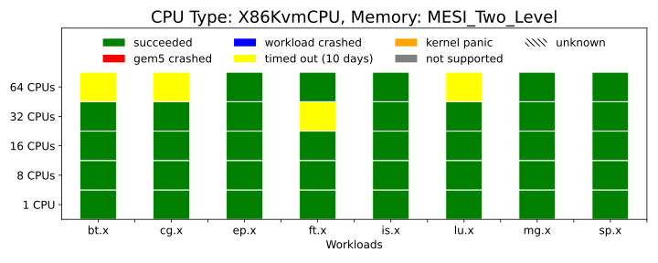
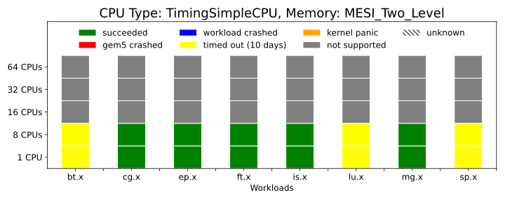

---
Authors:
  - Ayaz Akram
---

# Tutorial: Run NAS Parallel Benchmarks with gem5

## Introduction
In this tutorial, we will use gem5art to create a disk image for NAS parallel benchmarks ([NPB](https://www.nas.nasa.gov/)) and then run these benchmarks using gem5. NPB belongs to the category of high performance computing (HPC) workloads and consist of 5 kernels and 3 pseudo applications.
Following are their details:

Kernels:
- **IS:** Integer Sort, random memory access
- **EP:** Embarrassingly Parallel
- **CG:** Conjugate Gradient, irregular memory access and communication
- **MG:** Multi-Grid on a sequence of meshes, long- and short-distance communication, memory intensive
- **FT:** discrete 3D fast Fourier Transform, all-to-all communication

Pseudo Applications:
- **BT:** Block Tri-diagonal solver
- **SP:** Scalar Penta-diagonal solver
- **LU:** Lower-Upper Gauss-Seidel solver

There are different classes (A,B,C,D,E and F) of the workloads based on the data size that is used with the benchmarks. Detailed discussion of the data sizes is available [here](https://www.nas.nasa.gov/publications/npb_problem_sizes.html). In this tutorial, we will use only class A of these workloads.

We assume the following directory structure to follow in this tutorial:

```
npb/
  |___ gem5/                               # gem5 source code
  |
  |___ disk-image/
  |      |___ shared/                      # Auxiliary files needed for disk creation
  |      |___ npb/
  |            |___ npb-image/             # Will be created once the disk is generated
  |            |      |___ npb             # The generated disk image
  |            |___ npb.json               # The Packer script to build the disk image
  |            |___ runscript.sh           # Executes a user provided script in simulated guest
  |            |___ post-installation.sh   # Moves runscript.sh to guest's .bashrc
  |            |___ npb-install.sh         # Compiles NPB inside the generated disk image
  |            |___ npb-hooks              # The NPB source (modified to use with gem5).
  |
  |___ config.4.19.83                      # linux kernel configuration file
  |
  |___ configs
  |      |___ system                       # gem5 system config files
  |      |___ run_npb.py                   # gem5 run script to run NPB tests
  |
  |___ linux                               # Linux source and binary will live here
  |
  |___ launch_npb_tests.py                 # script to launch jobs and register artifacts
```


## Setting up the environment

First, we need to create the main directory named **npb-tests** (from where we will run everything) and turn it into a git repository.
Through the use of **npb-tests** git repo, we will try to keep track of changes in those files which are not included in any git repo otherwise.
An example of such files is gem5 run and config scripts.
We want to make sure that we can keep record of any changes in these scripts, so that a particular run of NPB benchmarks can be associated with a particular snapshot of these files.
We also need to add a git remote to this repo pointing to a remote location where we want this repo to be hosted.


```sh
mkdir npb-tests
cd npb-tests
git init
git remote add origin https://your-remote-add/npb-tests.git
```

We also need to add a .gitignore file in our git repo, to avoid tracking those files which are not important or will be tracked through other git repos:

```sh
*.pyc
m5out
.vscode
results
venv
disk-image/packer
disk-image/packer_1.4.3_linux_amd64.zip
disk-image/npb/npb-image/npb
disk-image/npb/npb-hooks
disk-image/packer_cache
gem5
linux-stable/
```

gem5art relies on Python 3, so we suggest creating a virtual environment before using gem5art.

```sh
virtualenv -p python3 venv
source venv/bin/activate
```

gem5art can be installed (if not already) using pip:

```sh
pip install gem5art-artifact gem5art-run gem5art-tasks
```

## Building gem5

Next clone gem5 from googlesource:

```sh
git clone https://gem5.googlesource.com/public/gem5
```

If you want to use the exact gem5 source that was used at the time of creating this tutorial you will have to checkout the relevant commit. If you want to try with the current version of gem5 at the time of reading this tutorial, you can ignore the git checkout command.

```sh
cd gem5
git checkout v20.1.0.0;
scons build/X86/gem5.opt -j8
```

Also make sure to build the m5 utility which will be moved to the disk image eventually.
m5 utility allows to trigger simulation tasks from inside the simulated system.
For example, it can be used dump simulation statistics when the simulated system triggers to do so.
We will need m5 mainly to exit the simulation when the simulated system will be done with the execution of a particular NPB benchmark.

```sh
cd gem5/util/m5/
scons build/x86/out/m5
```

## Creating a disk image
First create a disk-image folder where we will keep all disk image related files:

```sh
mkdir disk-image
```

We will follow the similar directory structure as discussed in [Disk Images](../main-doc/disks.md) section.
Add a folder named shared for config files which will be shared among all disk images (and will be kept to their defaults) and one folder named npb which will contain files configured for NPB disk image. Add [preseed.cfg](https://github.com/darchr/gem5art/blob/master/docs/disks/shared/preseed.cfg) and [serial-getty@.service](https://github.com/darchr/gem5art/blob/master/docs/disks/shared/serial-getty@.service) in shared/.

In npb/ we will add the benchmark source first, which will eventually be transferred to the disk image through our npb.json file.

```sh
cd disk-image/npb
git clone https://github.com/darchr/npb-hooks.git
```

This source of NPB has ROI (region of interest) annotations for each benchmark which will be used by gem5 to
separate out simulation statistics of the important parts of a program from the rest of the program.
Basically, gem5 magic instructions are used before and after the ROI which exit the guest and transfer control to gem5 run script which can then do things like dumping or resetting stats or switching to cpu of interest.

Next, we will add few other files in npb/ which will be used for compilation of NPB inside the disk image and eventually running of these benchmarks with gem5.
These files will be moved from host to the disk image using npb.json file as we will soon see.

First, create a file **npb-install.sh**, which will be executed inside the disk image (once it is built) and will install NPB on the disk image:

```sh
# install build-essential (gcc and g++ included) and gfortran

#Compile NPB

echo "12345" | sudo apt-get install build-essential gfortran

cd /home/gem5/NPB3.3-OMP/

mkdir bin

make suite HOOKS=1
```
`HOOKS=1` flag in the above make command enables the ROI annotations while compiling NPB workloads.
We are specifically compiling OpenMP (OMP) version of class A, B, C and D of NPB workloads.

To configure the benchmark build process, the source of NPB which we are using relies on modified **make.def** and **suite.def** files (build system files). Look [here](https://github.com/darchr/npb-hooks/blob/master/NPB3.3.1/NPB3.3-OMP/README.install), to understand the build process of NAS parallel benchmarks.
**suite.def** file is used to determine which workloads (and of which class) do we want to compile when we run **make suite** command (as in the above script).
You can look at the modified suite.def file [here](https://github.com/darchr/npb-hooks/blob/master/NPB3.3.1/NPB3.3-OMP/config/suite.def).

The **make.def** file we are using add OMP flags to the compiler flags to compile OMP version of the benchmarks. We also add another flag **-DM5OP_ADDR=0xFFFF0000** to the compiler flags, which makes sure that the gem5 magic instructions added to the benchmarks will also work in KVM mode.
You can look at the complete file [here](https://github.com/darchr/npb-hooks/blob/master/NPB3.3.1/NPB3.3-OMP/config/make.def).

In npb/, create a file **post-installation.sh** and add following lines to it:

```sh
#!/bin/bash
echo 'Post Installation Started'

mv /home/gem5/serial-getty@.service /lib/systemd/system/

mv /home/gem5/m5 /sbin
ln -s /sbin/m5 /sbin/gem5

# copy and run outside (host) script after booting
cat /home/gem5/runscript.sh >> /root/.bashrc

echo 'Post Installation Done'
```

This **post-installation.sh** script (which is a script to run after Ubuntu is installed on the disk image) installs m5 and copies the contents of **runscript.sh** to **.bashrc**.
Therefore, we need to add those things in runscript.sh which we want to execute as soon as the system boots up.
Create runscript.sh in npb/ and add following lines to it:

```sh
#!/bin/sh

m5 readfile > script.sh
if [ -s script.sh ]; then
    # if the file is not empty, execute it
    chmod +x script.sh
    ./script.sh
    m5 exit
fi
# otherwise, drop to the terminal
```
**runscript.sh** uses **m5 readfile** to read the contents of a script which is how gem5 passes scripts to the simulated system from the host system.
The passed script will then be executed and will be responsible for running benchmark/s which we will look into more later.

Finally, create **npb.json** and add following contents:

```json
{
    "builders":
    [
        {
            "type": "qemu",
            "format": "raw",
            "accelerator": "kvm",
            "boot_command":
            [
                "{{ user `boot_command_prefix` }}",
                "debian-installer={{ user `locale` }} auto locale={{ user `locale` }} kbd-chooser/method=us ",
                "file=/floppy/{{ user `preseed` }} ",
                "fb=false debconf/frontend=noninteractive ",
                "hostname={{ user `hostname` }} ",
                "/install/vmlinuz noapic ",
                "initrd=/install/initrd.gz ",
                "keyboard-configuration/modelcode=SKIP keyboard-configuration/layout=USA ",
                "keyboard-configuration/variant=USA console-setup/ask_detect=false ",
                "passwd/user-fullname={{ user `ssh_fullname` }} ",
                "passwd/user-password={{ user `ssh_password` }} ",
                "passwd/user-password-again={{ user `ssh_password` }} ",
                "passwd/username={{ user `ssh_username` }} ",
                "-- <enter>"
            ],
            "cpus": "{{ user `vm_cpus`}}",
            "disk_size": "{{ user `image_size` }}",
            "floppy_files":
            [
                "shared/{{ user `preseed` }}"
            ],
            "headless": "{{ user `headless` }}",
            "http_directory": "shared/",
            "iso_checksum": "{{ user `iso_checksum` }}",
            "iso_checksum_type": "{{ user `iso_checksum_type` }}",
            "iso_urls": [ "{{ user `iso_url` }}" ],
            "memory": "{{ user `vm_memory`}}",
            "output_directory": "npb/{{ user `image_name` }}-image",
            "qemuargs":
            [
                [ "-cpu", "host" ],
                [ "-display", "none" ]
            ],
            "qemu_binary":"/usr/bin/qemu-system-x86_64",
            "shutdown_command": "echo '{{ user `ssh_password` }}'|sudo -S shutdown -P now",
            "ssh_password": "{{ user `ssh_password` }}",
            "ssh_username": "{{ user `ssh_username` }}",
            "ssh_wait_timeout": "60m",
            "vm_name": "{{ user `image_name` }}"
        }
    ],
    "provisioners":
    [
        {
            "type": "file",
            "source": "../gem5/util/m5/m5",
            "destination": "/home/gem5/"
        },
        {
            "type": "file",
            "source": "shared/serial-getty@.service",
            "destination": "/home/gem5/"
        },
        {
            "type": "file",
            "source": "npb/runscript.sh",
            "destination": "/home/gem5/"
        },
        {
            "type": "file",
            "source": "npb/npb-hooks/NPB3.3.1/NPB3.3-OMP",
            "destination": "/home/gem5/"
        },
        {
            "type": "shell",
            "execute_command": "echo '{{ user `ssh_password` }}' | {{.Vars}} sudo -E -S bash '{{.Path}}'",
            "scripts":
            [
                "npb/post-installation.sh",
                "npb/npb-install.sh"
            ]
        }
    ],
    "variables":
    {
        "boot_command_prefix": "<enter><wait><f6><esc><bs><bs><bs><bs><bs><bs><bs><bs><bs><bs><bs><bs><bs><bs><bs><bs><bs><bs><bs><bs><bs><bs><bs><bs><bs><bs><bs><bs><bs><bs><bs><bs><bs><bs><bs><bs><bs><bs><bs><bs><bs><bs><bs><bs><bs><bs><bs><bs><bs><bs><bs><bs><bs><bs><bs><bs><bs><bs><bs><bs><bs><bs><bs><bs><bs><bs><bs><bs><bs><bs><bs><bs><bs><bs><bs><bs><bs><bs><bs><bs><bs><bs><bs><bs><bs><bs>",
        "desktop": "false",
        "image_size": "12000",
        "headless": "true",
        "iso_checksum": "34416ff83179728d54583bf3f18d42d2",
        "iso_checksum_type": "md5",
        "iso_name": "ubuntu-18.04.2-server-amd64.iso",
        "iso_url": "http://old-releases.ubuntu.com/releases/18.04.2/ubuntu-18.04.2-server-amd64.iso",
        "locale": "en_US",
        "preseed" : "preseed.cfg",
        "hostname": "gem5",
        "ssh_fullname": "gem5",
        "ssh_password": "12345",
        "ssh_username": "gem5",
        "vm_cpus": "16",
        "vm_memory": "8192",
        "image_name": "npb"
  }

}
```

**npb.json** is our primary .json configuration file. The provisioners and variables section of this file configure the files that need to be transferred to the disk and other things like disk image's name.

Next, download packer (if not already downloaded) in the disk-image folder:

```
cd disk-image/
wget https://releases.hashicorp.com/packer/1.4.3/packer_1.4.3_linux_amd64.zip
unzip packer_1.4.3_linux_amd64.zip
```
Now, to build the disk image inside the disk-image folder, run:

```
./packer validate npb/npb.json

./packer build npb/npb.json
```

Once this process succeeds, the created disk image can be found on `npb/npb-image/npb`.
A disk image already created following the above instructions can be found, gzipped, [here](http://dist.gem5.org/dist/v20-1/images/x86/ubuntu-18-04/npb.img.gz).

## Compiling the linux kernel

In this tutorial, we use of the LTS (long term support) releases of linux kernel v4.19.83 with gem5 to run NAS parallel benchmarks.
First, get the linux kernel config file from [here](https://gem5.googlesource.com/public/gem5-resources/+/refs/heads/stable/src/boot-exit/linux-configs/), and place it in npb-tests folder.
Then, we will get the linux source of version 4.19.83:

```
git clone --branch v4.19.83 --depth 1 https://git.kernel.org/pub/scm/linux/kernel/git/stable/linux.git
mv linux linux-stable
cd linux-stable
```
Compile the linux kernel from its source (using already downloaded config file config.4.19.83):

```
cp ../config.4.19.83 .config
make -j8
cp vmlinux vmlinux-4.19.83
```

**Note:** The above instructions are tested with `gcc 7.5.0` and an already compiled Linux binary can be downloaded from the following link:

- [vmlinux-4.19.83](http://dist.gem5.org/dist/v20-1/kernels/x86/static/vmlinux-4.19.83)

## gem5 run scripts

Next, we need to add gem5 run scripts. We will do that in a folder named configs-npb-tests.
Get the run script named run_npb.py from [here](https://gem5.googlesource.com/public/gem5-resources/+/refs/heads/stable/src/npb/configs/run_npb.py), and other system configuration files from
[here]((https://gem5.googlesource.com/public/gem5-resources/+/refs/heads/stable/src/npb/configs/system/).

The main script `run_npb.py` expects following arguments:

**kernel:** path to the Linux kernel.

**disk:** path to the npb disk image.

**cpu:** CPU model (`kvm`, `atomic`, `timing`).

**mem_sys:** memory system (`classic`, `MI_example`, `MESI_Two_Level`, `MOESI_CMP_directory`).

**benchmark:** NPB benchmark to execute (`bt.A.x`, `cg.A.x`, `ep.A.x`, `ft.A.x`, `is.A.x`, `lu.A.x`, `mg.A.x`,  `sp.A.x`).

**Note:**
By default, the previously written instructions to build npb disk image will build class `A`,`B`,`C` and `D` of NPB in the disk image.
We have only tested class `A` of the NPB.
Replace `A` with any other class in the above listed benchmark names to test with other classes.

**num_cpus:** number of CPU cores.

## Database and Celery Server

If not already running/created, you can create a database using:

```sh
`docker run -p 27017:27017 -v <absolute path to the created directory>:/data/db --name mongo-<some tag> -d mongo`
```
in a newly created directory.

If not already installed, install `RabbitMQ` on your system (before running celery) using:

```sh
apt-get install rabbitmq-server
```

Now, run celery server using:

```sh
celery -E -A gem5art.tasks.celery worker --autoscale=[number of workers],0
```

**Note:** Celery is not required to run gem5 jobs with gem5art. You can also use python multiprocessing library based function calls (provided by gem5art) to launch these jobs in parallel (we will show how to do that later in our launch script).


## Creating a launch script
Finally, we will create a launch script with the name **launch_npb_tests.py**, which will be responsible for registering the artifacts to be used and then launching gem5 jobs.

The first thing to do in the launch script is to import required modules and classes:

```python
import os
import sys
from uuid import UUID
from itertools import starmap
from itertools import product

from gem5art.artifact import Artifact
from gem5art.run import gem5Run
from gem5art.tasks.tasks import run_gem5_instance
import multiprocessing as mp
```

Next, we will register artifacts. For example, to register packer artifact we will add the following lines:

```python
packer = Artifact.registerArtifact(
    command = '''wget https://releases.hashicorp.com/packer/1.4.3/packer_1.4.3_linux_amd64.zip;
    unzip packer_1.4.3_linux_amd64.zip;
    ''',
    typ = 'binary',
    name = 'packer',
    path =  'disk-image/packer',
    cwd = 'disk-image',
    documentation = 'Program to build disk images. Downloaded sometime in August/19 from hashicorp.'
)
```

For our npb-tests repo,

```python
experiments_repo = Artifact.registerArtifact(
    command = 'git clone https://your-remote-add/npb-tests.git',
    typ = 'git repo',
    name = 'npb-tests',
    path =  './',
    cwd = '../',
    documentation = 'main repo to run npb with gem5'
)
```

Note that the name of the artifact (returned by the registerArtifact method) is totally up to the user as well as most of the other attributes of these artifacts.

For all other artifacts, add following lines in launch_npb_tests.py:

```python
gem5_repo = Artifact.registerArtifact(
    command = 'git clone https://gem5.googlesource.com/public/gem5',
    typ = 'git repo',
    name = 'gem5',
    path =  'gem5/',
    cwd = './',
    documentation = 'cloned gem5 from googlesource and checked out v20.1.0.0'
)

m5_binary = Artifact.registerArtifact(
    command = 'scons build/x86/out/m5',
    typ = 'binary',
    name = 'm5',
    path =  'gem5/util/m5/build/x86/out/m5',
    cwd = 'gem5/util/m5',
    inputs = [gem5_repo,],
    documentation = 'm5 utility'
)

disk_image = Artifact.registerArtifact(
    command = 'packer build npb.json',
    typ = 'disk image',
    name = 'npb',
    cwd = 'disk-image/npb',
    path = 'disk-image/npb/npb-image/npb',
    inputs = [packer, experiments_repo, m5_binary,],
    documentation = 'Ubuntu with m5 binary and NPB (with ROI annotations: darchr/npb-hooks/) installed.'
)

gem5_binary = Artifact.registerArtifact(
    command = '''cd gem5;
    git checkout v20.1.0.0;
    scons build/X86/gem5.opt -j8
    ''',
    typ = 'gem5 binary',
    name = 'gem5',
    cwd = 'gem5/',
    path =  'gem5/build/X86/gem5.opt',
    inputs = [gem5_repo,],
    documentation = 'gem5 binary based on v20.1.0.0'
)

gem5_binary_MESI_Two_Level = Artifact.registerArtifact(
    command = '''cd gem5;
    git checkout v20.1.0.0;
    scons build/X86_MESI_Two_Level/gem5.opt --default=X86 PROTOCOL=MESI_Two_Level SLICC_HTML=True -j8
    ''',
    typ = 'gem5 binary',
    name = 'gem5',
    cwd = 'gem5/',
    path =  'gem5/build/X86_MESI_Two_Level/gem5.opt',
    inputs = [gem5_repo,],
    documentation = 'gem5 binary based on v20.1.0.0'
)

linux_repo = Artifact.registerArtifact(
    command = '''git clone https://git.kernel.org/pub/scm/linux/kernel/git/stable/linux.git;
    mv linux linux-stable''',
    typ = 'git repo',
    name = 'linux-stable',
    path =  'linux-stable/',
    cwd = './',
    documentation = 'linux kernel source code repo from June 24-2020'
)

linux_binary = Artifact.registerArtifact(
    name = 'vmlinux-4.19.83',
    typ = 'kernel',
    path = 'linux-stable/vmlinux-4.19.83',
    cwd = 'linux-stable/',
    command = '''
    cp ../config.4.19.83 .config;
    make -j8;
    cp vmlinux vmlinux-4.19.83;
    ''',
    inputs = [experiments_repo, linux_repo,],
    documentation = "kernel binary for v4.19.83",
)
```

Once, all the artifacts are registered the next step is to launch all gem5 jobs. To do that, first we will create a method `createRun` to create gem5art runs based on a few arguments:


```python

def createRun(bench, clas, cpu, mem, num_cpu):

    if mem == 'MESI_Two_Level':
        binary_gem5 = 'gem5/build/X86_MESI_Two_Level/gem5.opt'
        artifact_gem5 = gem5_binary_MESI_Two_Level
    else:
        binary_gem5 = 'gem5/build/X86/gem5.opt'
        artifact_gem5 = gem5_binary

    return gem5Run.createFSRun(
        'npb with gem5-20.1',
        binary_gem5,
        'configs-npb-tests/run_npb.py',
        f'''results/run_npb_multicore/{bench}/{clas}/{cpu}/{num_cpu}''',
        artifact_gem5, gem5_repo, experiments_repo,
        'linux-stable/vmlinux-4.19.83',
        'disk-image/npb/npb-image/npb',
        linux_binary, disk_image,
        cpu, mem, bench.replace('.x', f'.{clas}.x'), num_cpu,
        timeout = 240*60*60 #240 hours
        )
```

Next, initialize all the parameters to pass to `createRun` method, depending on the configuration space we want to test:

```python
if __name__ == "__main__":
    num_cpus = ['1', '8']
    benchmarks = ['is.x', 'ep.x', 'cg.x', 'mg.x','ft.x', 'bt.x', 'sp.x', 'lu.x']

    classes = ['A']
    mem_sys = ['MESI_Two_Level']
    cpus = ['kvm', 'timing']
```

Then, to run actual jobs depending on if you want to use celery or python multiprocessing library, add the following in your launch script:

## If Using Celery

```python
    # For the cross product of tests, create a run object.
    runs = starmap(createRun, product(benchmarks, classes, cpus, mem_sys, num_cpus))
    # Run all of these experiments in parallel
    for run in runs:
        run_gem5_instance.apply_async((run, os.getcwd(),))
```


## If Using Python Multiprocessing Library:

```python
    def worker(run):
        run.run()
        json = run.dumpsJson()
        print(json)

    jobs = []

    # For the cross product of tests, create a run object.
    runs = starmap(createRun, product(benchmarks, classes, cpus, mem_sys, num_cpus))
    # Run all of these experiments in parallel
    for run in runs:
        jobs.append(run)

    with mp.Pool(mp.cpu_count() // 2) as pool:
         pool.map(worker, jobs)
```

The above lines are responsible for looping through all possible combinations of variables involved in this experiment.
For each combination, a gem5Run object is created and eventually passed to run_gem5_instance to be executed asynchronously if using Celery.
In case of python multiprocessing library, these run objects are pushed to a list and then mapped to a job pool.
Look at the definition of `createFSRun()` [here](../main-doc/run.html#gem5art.run.gem5Run.createFSRun) to understand the use of passed arguments.

Here, we are using a timeout of 240 hours, after which the particular gem5 job will be killed (assuming that gem5 should complete the booting process of linux kernel on the given hardware resources). You can configure this time according to your settings.

The complete launch script is available [here:](https://github.com/darchr/gem5art/blob/master/docs/launch-scripts/launch_npb_tests.py).
Finally, make sure you are in python virtual env and then run the script:

```python
python launch_boot_tests.py
```

## Results

Once you run the launch script, the declared artifacts will be registered by gem5art and stored in the database.
Celery will run as many jobs in parallel as allowed by the user (at the time of starting the server).
As soon as a gem5 job finishes, a compressed version of the results will be stored in the database as well.
User can also query the database using the methods discussed in the [Artifacts](../main-doc/artifacts.md), [Runs](../main-doc/runs.md) sections and [boot-test](boot-tutorial.md) tutorial previously.

The status of working of the NAS parallel benchmarks on gem5 based on the results from the experiments of this tutorial is following:




You can look [here](https://www.gem5.org/documentation/benchmark_status/gem5-20) for the latest status of these tests on gem5.
