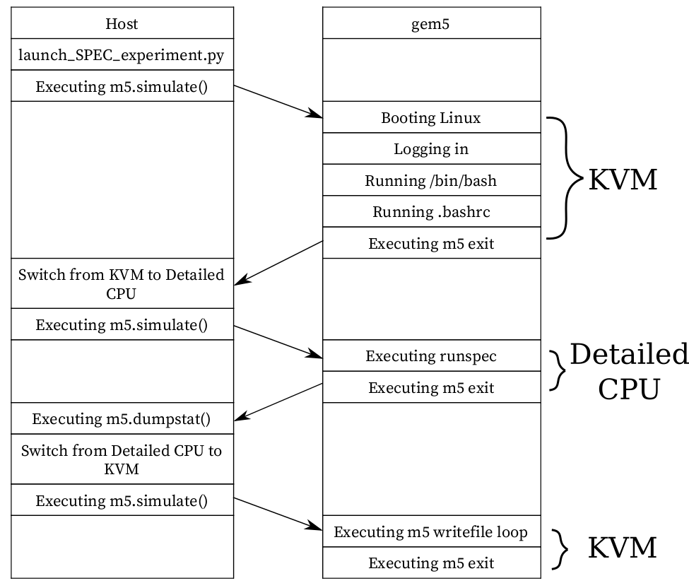

---
Authors:
  - Hoa Nguyen
---

# Tutorial: Run SPEC CPU 2017 Benchmarks in Full System Mode with gem5art

## Introduction
In this tutorial, we will demonstrate how to utilize gem5art to run SPEC CPU 2017 benchmarks in gem5 full system mode.
The full example with all of the gem5art tutorials can be found [here](https://github.com/darchr/gem5art-experiments).
The scripts in this tutorial work with gem5art-* v1.3.0 and gem5 20.1.0.2 stable.

**Note**: This steps in this tutorial are mostly identical to those of [the SPEC 2006 tutorial](spec2006-tutorial.md).
The differences are in the scripts used to create the disk image, and the name of the benchmarks.


### SPEC CPU 2017 Benchmarks
More details about those benchmarks are [here](https://www.spec.org/cpu2017/Docs/).

### gem5 Full System Mode
Different from the gem5 SE (syscall emulation) mode, the full system mode uses an actual Linux kernel instead of emulating responsibilities of a typical modern OS, such as managing page tables, taking care of syscalls.
Therefore, the results would be more realistic when using gem5 FS, especially when the interactions between the workload and the OS are significant parts of the simulation.

In order to run gem5 in the full system mode, gem5 requires a built Linux kernel, which is configurable.
gem5 does not support all configurations in Linux, including the default Linux kernel configuration.
To accomondate this, we will provide Linux configurations that are to known to work with gem5.
(Please prefer to the [gem5's benchmark status page](https://www.gem5.org/documentation/benchmark_status) for details on what Linux has been tested with gem5.)
Other than that, a gem5 full system configuration is also a requirement to run gem5 full system mode.
In this tutorial, we will provide working Linux configurations, the necessary steps to build a Linux kernel, and a working gem5 full system configuration.

### Outline of the Experiment
We structure the experiment as follows (note that there are many more ways to structure the experiments, and the following is one of them),
* root folder
  * gem5: a folder containing gem5 source code and gem5 binaries.
  * disk-image: a folder containing inputs to produce a disk image containing SPEC CPU 2017 benchmarks.
  * linux-configs: a folder containing different Linux configurations for different Linux kernel versions.
  * gem5-configs: a folder containing a gem5 configuration that is made specifically to run SPEC CPU 2017 benchmarks.
  * results: a folder storing the experiment's results. This folder will have a certain structure in order to make sure that every gem5 run does not overwrite other gem5 runs results.
  * launch_spec2017_experiments.py: a script that does the following,
    * Documenting the experiment using Artifacts objects.
    * Running the experiment in gem5 full system mode.

### An Overview of Host System - gem5 Interactions

A visual depict of how gem5 interacts with the host system.
gem5 is configured to do the following: booting the Linux kernel, running the benchmark, and copying the SPEC outputs to the host system.
However, since we are interested in getting the stats only for the benchmark, we configure gem5 to exit after the kernel is booted, and then we reset the stats before running the benchmark.
We use KVM for Linux booting process as we want to quickly boot the system, and after the booting process is complete, we switch to the desired detailed CPU to run the benchmark.
Similarly, after the benchmark is complete, gem5 exits to host, which allows us to get the stats at that point.
After that, we switch the CPU back to KVM, which allows us to quickly write the SPEC output files to the host.

**Important:** gem5 will output the stats again when the gem5 run is complete.
Therefore, we will see two stats in one file in stats.txt.
The stats of the benchmark is the the first part of stats.txt, while the second part of the file contains the stats of the benchmark AND the process of writing output files back to the host.
We are only interested in the first part of stats.txt.

## Documenting the Preparing Steps
### Setting up the Experiment Folder
We set up a folder to contain (almost) all materials of the experiment.
We use git to keep track of changes in the folder.

```sh
mkdir spec2017-experiments
cd spec2017-experiments
git init
```

We need add a remote to the repository.

```sh
git remote add origin https://your-remote-add/spec2017-experiment.git
```

We document the root folder of the experiment in launch_spec2017_experiments.py as follows,

```sh
experiments_repo = Artifact.registerArtifact(
    command = '',
    typ = 'git repo',
    name = 'experiment',
    path =  './',
    cwd = './',
    documentation = 'local repo to run spec 2017 experiments with gem5'
)
```

We use .gitignore file to ignore changes of certain files or folders.
In this experiment, we will use this .gitignore file,

```
*.pyc
m5out
.vscode
results
gem5art-env
disk-image/packer
disk-image/spec-2017/spec-2017-image/spec-2017
disk-image/packer_cache
disk-image/spec-2017/cpu2017-1.1.0.iso
gem5
linux-4.19.83/
```

Essentially, we will ignore files and folders that when we use gem5art to keep track of them, or the presence of those files and folders do not affect the experiment's results.

### Building gem5
In this step, we download the source code and build gem5 v20.1.0.2.

```sh
git clone -b v20.1.0.2 https://gem5.googlesource.com/public/gem5
cd gem5
scons build/X86/gem5.opt -j8
```
We have two artifacts: one is the gem5 source code (the gem5 git repo), and the gem5 binary (`gem5.opt`).
The documentation of this step would be how we get the source code and how we compile the gem5 binary.
In launch_spec2017_experiments.py, we document the step in Artifact objects as follows,

```python
gem5_repo = Artifact.registerArtifact(
    command = '''
        git clone -b v20.1.0.2 https://gem5.googlesource.com/public/gem5
        cd gem5
        scons build/X86/gem5.opt -j8
    ''',
    typ = 'git repo',
    name = 'gem5',
    path =  'gem5/',
    cwd = './',
    documentation = 'cloned gem5 v20.1.0.2'
)


gem5_binary = Artifact.registerArtifact(
    command = 'scons build/X86/gem5.opt -j8',
    typ = 'gem5 binary',
    name = 'gem5-20.1.0.2',
    cwd = 'gem5/',
    path =  'gem5/build/X86/gem5.opt',
    inputs = [gem5_repo,],
    documentation = 'compiled gem5 v20.1.0.2 binary'
)
```

### Building m5
m5 is a binary that facilitates the communication between the host system and the guest system (gem5).
The examples of how m5 is used could be found in the runscripts that we will describe later.
m5 binary will be copied to the disk image, so that the guest could run m5 binary during the experiment.
Therefore, m5 binary should be compiled before we build the disk image.

**Note:** it's important to compile the m5 binary with -DM5_ADDR=0xFFFF0000 as is default in the Makefile. If you don't compile with -DM5_ADDR and try to run with KVM you'll get an illegal instruction error.

To compile m5 binary,

```sh
cd gem5/util/m5/
scons build/x86/out/m5
```

In launch_spec2017_experiments.py, we document the step in an Artifact object as follows,

```python
m5_binary = Artifact.registerArtifact(
    command = 'scons build/x86/out/m5',
    typ = 'binary',
    name = 'm5',
    path =  'gem5/util/m5/build/x86/out/m5',
    cwd = 'gem5/util/m5',
    inputs = [gem5_repo,],
    documentation = 'm5 utility'
)
```

### Preparing Scripts to Modify the Disk Image
In this step, we will prepare the scripts that will modify the disk image after the Ubuntu installation process has finished, and before the first time we use the disk image in gem5.
We will keep the related files in the disk-image folder of the experiment.
The files that are made specifically for SPEC 2017 benchmarks will be in disk-image/spec-2017, and the files that are commonly used accross most benchmarks will be in `disk-image/shared`.

In the root folder of the experiment,

```sh
mkdir disk-image
mkdir disk-image/spec-2017
mkdir disk-image/shared
```

The first script is the `runscript.sh script`, which will be appended to the end of `.bashrc` file.
Therefore, that script will run when we use the disk image in gem5, after the Linux booting process has finished.
Figure 1 describes how this script interacts with the gem5 config file.
The script could be found [here](https://gem5.googlesource.com/public/gem5-resources/+/a9db8cf1e2ea3c4b3ba84103afcdecfe345494c5/src/spec-2017/disk-image/spec-2017/runscript.sh).

To download the script, in the root folder of the experiment,

```sh
cd disk-image/spec-2017
wget -O - https://gem5.googlesource.com/public/gem5-resources/+/a9db8cf1e2ea3c4b3ba84103afcdecfe345494c5/src/spec-2017/disk-image/spec-2017/runscript.sh?format=TEXT | base64 --decode > runscript.sh
```
**Notes:** Due to the code hosting software at gem5.googlesource.com (Gitiles) only allows download the content of a file encrypted in base64, the above command downloads the encrypted content and pipelines it to `base64` utils, which decrypts the content and pipelines it to the `runscript.sh` file.

The second script is post-installation.sh script, which will copy the "auto logging in" script to the correct place, and copy the m5 binary to /sbin/ in the disk image.
This script will also append the above script (runscript.sh) to the end of `.bashrc`.
The script could be found [here](https://gem5.googlesource.com/public/gem5-resources/+/a9db8cf1e2ea3c4b3ba84103afcdecfe345494c5/src/spec-2017/disk-image/spec-2017/post-installation.sh).

To download the script, in the root folder of the experiment,

```sh
cd disk-image/spec-2017
wget -O - https://gem5.googlesource.com/public/gem5-resources/+/a9db8cf1e2ea3c4b3ba84103afcdecfe345494c5/src/spec-2017/disk-image/spec-2017/post-installation.sh?format=TEXT | base64 --decode > post-installation.sh
```

The third script is the `install-spec2017.sh` script, which will install the dependencies required to compile and run the SPEC 2017 benchmarks, which will be compiled and built in the script.
We figure out that the dependencies include `g++`, `gcc`, and `gfortran`.
So we will get the `build-essential` and `gfortran` packages from Debian (note that "12345" is the default password, this could be modified in the `spec-2017.json` file).
The script also modifies the default config script to make the benchmarks work with this set up.
The script could be found [here](https://gem5.googlesource.com/public/gem5-resources/+/a9db8cf1e2ea3c4b3ba84103afcdecfe345494c5/src/spec-2017/disk-image/spec-2017/install-spec2017.sh).

To download the script, in the root folder of the experiment,

```sh
cd disk-image/spec-2017
wget -O - https://gem5.googlesource.com/public/gem5-resources/+/a9db8cf1e2ea3c4b3ba84103afcdecfe345494c5/src/spec-2017/disk-image/spec-2017/install-spec2017.sh?format=TEXT | base64 --decode > install-spec2017.sh
```

We also need two other files: the auto logging in script and Ubuntu preseed.
Those files are usually reused by other benchmarks, so we will keep them in disk-image/shared.
The auto logging in script is [here](https://gem5.googlesource.com/public/gem5-resources/+/a9db8cf1e2ea3c4b3ba84103afcdecfe345494c5/src/spec-2017/disk-image/shared/preseed.cfg), and the Ubuntu preseed configuration is [here](https://gem5.googlesource.com/public/gem5-resources/+/a9db8cf1e2ea3c4b3ba84103afcdecfe345494c5/src/spec-2017/disk-image/shared/serial-getty%40.service).

In the root folder of the experiment,

```sh
cd disk-image/shared
wget -O - https://gem5.googlesource.com/public/gem5-resources/+/a9db8cf1e2ea3c4b3ba84103afcdecfe345494c5/src/spec-2017/disk-image/shared/preseed.cfg?format=TEXT | base64 --decode > preseed.cfg
 wget -O - https://gem5.googlesource.com/public/gem5-resources/+/a9db8cf1e2ea3c4b3ba84103afcdecfe345494c5/src/spec-2017/disk-image/shared/serial-getty%40.service?format=TEXT | base64 --decode > serial-getty@.service
```

We don't make Artifact objects for those scripts.
Instead, we let the Artifact repository object of the root folder to keep track of the changes in the above scripts.

### Building the Disk Image
Having prepared necessary scripts to create the disk image, in this step, we will build the disk image using [packer](https://www.packer.io/).

First, we download the packer binary.
The current version of packer as of November 2020 is 1.6.5.

```sh
cd disk-image/
wget https://releases.hashicorp.com/packer/1.6.5/packer_1.6.5_linux_amd64.zip
unzip packer_1.6.5_linux_amd64.zip
rm packer_1.6.5_linux_amd64.zip
```

In launch_spec2017_experiments.py, we document how we obtain the binary as follows,

```python
packer = Artifact.registerArtifact(
    command = '''
        wget https://releases.hashicorp.com/packer/1.6.5/packer_1.6.5_linux_amd64.zip;
        unzip packer_1.6.5_linux_amd64.zip;
    ''',
    typ = 'binary',
    name = 'packer',
    path =  'disk-image/packer',
    cwd = 'disk-image',
    documentation = 'Program to build disk images. Downloaded sometime in November from hashicorp.'
)
```

Second, we create a packer script (a json file) that describes how the disk image will be built.
In this step, we assume that we have the SPEC 2017 ISO file in the `disk-image/spec-2017` folder.
In this script, the ISO file name is cpu2017-1.1.0.iso.
The script is available [here](https://gem5.googlesource.com/public/gem5-resources/+/a9db8cf1e2ea3c4b3ba84103afcdecfe345494c5/src/spec-2017/disk-image/spec-2017/spec-2017.json), and we save the file at `disk-image/spec-2017/spec-2017.json`.

In the root folder of experiment,

```sh
cd disk-image/spec-2017/
wget https://gem5.googlesource.com/public/gem5-resources/+/a9db8cf1e2ea3c4b3ba84103afcdecfe345494c5/src/spec-2017/disk-image/spec-2017/spec-2017.json?format=TEXT | base64 --decode > spec-2017.json
```

To build the disk image,

```sh
cd disk-image/
./packer validate spec-2017/spec-2017.json # validate the script, including checking the input files
./packer build spec-2017/spec-2017.json
```

The process should not take more than an hour on a fairly recent machine with a normal internet speed.
The disk image will be in `disk-image/spec-2017/spec-2017-image/spec-2017`.

**Note:**: Packer will output a VNC port that could be used to inspect the building process.
Ubuntu has a built-in VNC viewer, namely Remmina.

**Note:**: [More about using packer and building disk images](../main-doc/disks.md).

Now, in launch_spec2017_experiments.py, we make an Artifact object of the disk image.

```python
disk_image = Artifact.registerArtifact(
    command = './packer build spec-2017/spec-2017.json',
    typ = 'disk image',
    name = 'spec-2017',
    cwd = 'disk-image/',
    path = 'disk-image/spec-2017/spec-2017-image/spec-2017',
    inputs = [packer, experiments_repo, m5_binary,],
    documentation = 'Ubuntu Server with SPEC 2017 installed, m5 binary installed and root auto login'
)
```

### Compiling Linux Kernel
In this step, we will download Linux kernel source code and compile the Linux kernel.
The file of interest in this step is the vmlinux file.

First, we download the Linux kernel source code.
Version 4.19.83 has been tested with gem5 as discussed [in the other tutorial](boot-tutorial.md).
We suggest using config files that have been tested with gem5.
The following command will shallow clone the linux stable repository as well as checking out the tag v4.19.83, which contains the code for linux kernel version 4.19.83.
The git command also works well for other version numbers.

In the root of the experiment folder,

```sh
git clone --branch v4.19.83 --depth 1 https://git.kernel.org/pub/scm/linux/kernel/git/stable/linux.git/
mv linux linux-4.19.83
```

Now, in launch_spec2017_experiments.py, we make an Artifact object of the Linux stable git repo.

```python
linux_repo = Artifact.registerArtifact(
    command = '''
    	git clone git clone --branch v4.19.83 --depth 1 https://git.kernel.org/pub/scm/linux/kernel/git/stable/linux.git/;
    	mv linux linux-4.19.83
    ''',
    typ = 'git repo',
    name = 'linux-4.19.83',
    path =  'linux-4.19.83',
    cwd = './',
    documentation = 'Linux kernel 4.19 source code repo obtained in November'
)
```

Next, we compile the Linux kernel.
We will make a folder named linux-configs containing all working linux configs.
Working Linux configs and documentations for generating a Linux config are discussed here [here](boot-tutorial.md).

In the root folder of the experiment,

```sh
mkdir linux-configs
```

To download the linux-4.19.83 configs,

```sh
cd linux-configs
wget https://gem5.googlesource.com/public/gem5-resources/+/a9db8cf1e2ea3c4b3ba84103afcdecfe345494c5/src/linux-kernel/linux-configs/config.4.19.83?format=TEXT | base64 --decode > config.4.19.83
```

The following commands will copy the linux config and compile the linux kernel.
In the root folder of the experiment,

```sh
cp linux-configs/config.4.19.83 linux-4.19.83/.config
cd linux-4.19.83
make -j8
cp vmlinux vmlinux-4.19.83
```

Now, in launch_spec2017_experiments.py, we make an Artifact object of the Linux kernel binary.

```python
linux_binary = Artifact.registerArtifact(
    name = 'vmlinux-4.19.83',
    typ = 'kernel',
    path = 'linux-4.19.83/vmlinux-4.19.83',
    cwd = './',
    command = '''
        cp linux-configs/config.4.19.83 linux-4.19.83/.config
        cd linux-4.19.83
        make -j8
        cp vmlinux vmlinux-4.19.83
    ''',
    inputs = [experiments_repo, linux_repo,],
    documentation = "kernel binary for v4.19.83",
)
```

### The gem5 Run Script/gem5 Configuration
In this step, we take a look at the final missing piece: the gem5 run script.
The script is where we specify the simulated system.
We offer example scripts in the [spec-2017/configs folder](https://gem5.googlesource.com/public/gem5-resources/+/a9db8cf1e2ea3c4b3ba84103afcdecfe345494c5/src/spec-2017/configs/).

First, we create a folder named gem5-configs containing all gem5 configs.
Since gem5art requires a git repo for the run scripts, we will make a local git repo for the run scripts.

In the root folder of the experiment,

```sh
mkdir gem5-configs
cd gem5-configs
git init
```

Then we copy all the scripts in configs-spec-tests folder to gem5-configs.

In the root folder of the experiment,

```sh
cd gem5-configs
wget -O - https://gem5.googlesource.com/public/gem5-resources/+/a9db8cf1e2ea3c4b3ba84103afcdecfe345494c5/src/spec-2017/configs/run_spec.py?format=TEXT | base64 --decode > run_spec.py
mkdir -p system
cd system
wget -O - https://gem5.googlesource.com/public/gem5-resources/+/a9db8cf1e2ea3c4b3ba84103afcdecfe345494c5/src/spec-2017/configs/system/__init__.py?format=TEXT | base64 --decode > __init__.py
wget -O - https://gem5.googlesource.com/public/gem5-resources/+/a9db8cf1e2ea3c4b3ba84103afcdecfe345494c5/src/spec-2017/configs/system/caches.py?format=TEXT | base64 --decode > caches.py
wget -O - https://gem5.googlesource.com/public/gem5-resources/+/a9db8cf1e2ea3c4b3ba84103afcdecfe345494c5/src/spec-2017/configs/system/fs_tools.py?format=TEXT | base64 --decode > fs_tools.py
wget -O - https://gem5.googlesource.com/public/gem5-resources/+/a9db8cf1e2ea3c4b3ba84103afcdecfe345494c5/src/spec-2017/configs/system/system.py?format=TEXT | base64 --decode > system.py
cd ..
git add *
git commit -m "Add run scripts for SPEC 2017"
```

In launch_spec2017_experiments.py, we make an Artifact object of the Linux kernel binary.

```python
run_script_repo = Artifact.registerArtifact(
    command = '''
      wget -O - https://gem5.googlesource.com/public/gem5-resources/+/a9db8cf1e2ea3c4b3ba84103afcdecfe345494c5/src/spec-2017/configs/run_spec.py?format=TEXT | base64 --decode > run_spec.py
      mkdir -p system
      cd system
      wget -O - https://gem5.googlesource.com/public/gem5-resources/+/a9db8cf1e2ea3c4b3ba84103afcdecfe345494c5/src/spec-2017/configs/system/__init__.py?format=TEXT | base64 --decode > __init__.py
      wget -O - https://gem5.googlesource.com/public/gem5-resources/+/a9db8cf1e2ea3c4b3ba84103afcdecfe345494c5/src/spec-2017/configs/system/caches.py?format=TEXT | base64 --decode > caches.py
      wget -O - https://gem5.googlesource.com/public/gem5-resources/+/a9db8cf1e2ea3c4b3ba84103afcdecfe345494c5/src/spec-2017/configs/system/fs_tools.py?format=TEXT | base64 --decode > fs_tools.py
      wget -O - https://gem5.googlesource.com/public/gem5-resources/+/a9db8cf1e2ea3c4b3ba84103afcdecfe345494c5/src/spec-2017/configs/system/system.py?format=TEXT | base64 --decode > system.py
    ''',
    typ = 'git repo',
    name = 'gem5-configs',
    path =  'gem5-configs',
    cwd = './',
    documentation = 'gem5 run scripts made specifically for SPEC benchmarks'
)
```

The gem5 run script, [run_spec.py](https://github.com/darchr/gem5art/blob/master/docs/configs-spec-tests/run_spec.py), takes the following parameters:
* --kernel: (required) the path to vmlinux file.
* --disk: (required) the path to spec image.
* --cpu: (required) name of the detailed CPU model.
Currently, we are supporting the following CPU models: kvm, o3, atomic, timing.
More CPU models could be added to getDetailedCPUModel() in run_spec.py.
* --benchmark: (required) name of the SPEC CPU 2017 benchmark.
The availability of the benchmarks could be found at the end of the tutorial.
* --size: (required) size of the benchmark. There are three options: ref, train, test.
* --no-copy-logs: this is an optional parameter specifying whether the spec log files should be copied to the host system.
* --allow-listeners: this is an optional parameter specifying whether gem5 should open ports so that gdb or telnet could connect to. No listeners are allowed by default.

We don't use another Artifact object to document this file.
The Artifact repository object of the root folder will keep track of the changes of the script.

**Note:** The first two parameters of the gem5 run script for full system simulation should always be the path to the linux binary and the path to the disk image, in that order.


## Run the Experiment
### Setting up the Python virtual environment
gem5art code works with Python 3.5 or above.

The following script will set up a python3 virtual environment named gem5art-env. In the root folder of the experiment,

```sh
virtualenv -p python3 gem5art-env
```

To activate the virtual environment, in the root folder of the experiment,

```sh
source gem5art-env/bin/activate
```

To install the gem5art dependency (this should be done when we are in the virtual environment),

```sh
pip install gem5art-artifact gem5art-run gem5art-tasks
```

To exit the virtual environment,

```sh
deactivate
```

**Note:** the following steps should be done while using the Python virtual environment.

### Running the Database Server
The following script will run the MongoDB database server in a docker container.

The -p 27017:27017 option maps the port 27017 in the container to port 27017 on the host.
The -v /path/in/host:/data/db option mounts the /data/db folder in the docker container to the folder /path/in/host in the host.
The path of the host folder should an absoblute path, and the database files created by MongoDB will be in that folder.
The --name mongo-1 option specifies the name of the docker container.
We can use this name to identify to the container.
The -d option will let the container run in the background.
mongo is the name of [the offical mongo image](https://hub.docker.com/_/mongo).

```sh
docker run -p 27017:27017 -v /path/in/host:/data/db --name mongo-1 -d mongo
```

### Running Celery Server
Inisde the path in the host specified above,

```sh
celery -E -A gem5art.tasks.celery worker --autoscale=[number of workers],0
```

### Creating the Launch Script Running the Experiment
Now, we can put together the run script!
In launch_spec2017_experiments.py, we import the required modules and classes at the beginning of the file,

```python
import os
import sys
from uuid import UUID

from gem5art.artifact import Artifact
from gem5art.run import gem5Run
from gem5art.tasks.tasks import run_gem5_instance
```

And then, we put the launch function at the end of launch_spec2017_experiments.py,

```python
if __name__ == "__main__":
    cpus = ['kvm', 'atomic', 'o3', 'timing']
    benchmark_sizes = {'kvm':    ['test', 'ref'],
                       'atomic': ['test'],
                       'o3':     ['test'],
                       'timing': ['test']
                      }
    benchmarks = ["503.bwaves_r", "507.cactuBSSN_r", "508.namd_r", "510.parest_r", "511.povray_r", "519.lbm_r",
                  "521.wrf_r", "526.blender_r", "527.cam4_r", "538.imagick_r", "544.nab_r", "549.fotonik3d_r",
                  "554.roms_r", "997.specrand_fr", "603.bwaves_s", "607.cactuBSSN_s", "619.lbm_s", "621.wrf_s",
                  "627.cam4_s", "628.pop2_s", "638.imagick_s", "644.nab_s", "649.fotonik3d_s", "654.roms_s",
                  "996.specrand_fs", "500.perlbench_r", "502.gcc_r", "505.mcf_r", "520.omnetpp_r", "523.xalancbmk_r",
                  "525.x264_r", "531.deepsjeng_r", "541.leela_r", "548.exchange2_r", "557.xz_r", "999.specrand_ir",
                  "600.perlbench_s", "602.gcc_s", "605.mcf_s", "620.omnetpp_s", "623.xalancbmk_s", "625.x264_s",
                  "631.deepsjeng_s", "641.leela_s", "648.exchange2_s", "657.xz_s", "998.specrand_is"]

    for cpu in cpus:
        for size in benchmark_sizes[cpu]:
            for benchmark in benchmarks:
                run = gem5Run.createFSRun(
                    'gem5 20.1.0.2 spec 2017 experiment', # name
                    'gem5/build/X86/gem5.opt', # gem5_binary
                    'gem5-configs/run_spec.py', # run_script
                    'results/{}/{}/{}'.format(cpu, size, benchmark), # relative_outdir
                    gem5_binary, # gem5_artifact
                    gem5_repo, # gem5_git_artifact
                    run_script_repo, # run_script_git_artifact
                    'linux-4.19.83/vmlinux-4.19.83', # linux_binary
                    'disk-image/spec-2017/spec-2017-image/spec-2017', # disk_image
                    linux_binary, # linux_binary_artifact
                    disk_image, # disk_image_artifact
                    cpu, benchmark, size, # params
                    timeout = 5*24*60*60 # 5 days
                )
                run_gem5_instance.apply_async((run,))

```
The above launch function will run the all the available benchmarks with kvm, atomic, timing, and o3 cpus.
For kvm, both test and ref sizes will be run, while for the rest, only benchmarks of size test will be run.

Note that the line `'results/{}/{}/{}'.format(cpu, size, benchmark), # relative_outdir` specifies how the results folder is structured.
The results folder should be carefully structured so that there does not exist two gem5 runs write to the same place.

### Run the Experiment
Having celery and mongoDB servers running, we can start the experiment.

In the root folder of the experiment,

```sh
python3 launch_spec2017_experiment.py
```

## Appendix I. Working SPEC 2017 Benchmarks x CPU Model Matrix
All benchmarks are compiled in the above set up as of March 2020.
The working status of SPEC 2017 workloads is available here: [https://www.gem5.org/documentation/benchmark_status/gem5-20#spec-2017-tests](https://www.gem5.org/documentation/benchmark_status/gem5-20#spec-2017-tests).


